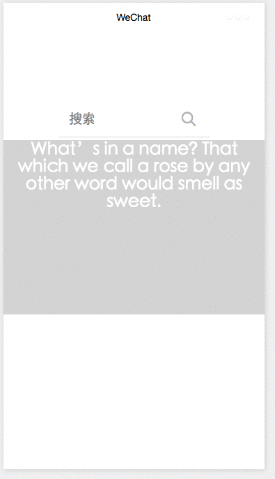

# wxblur

微信小程序demo

### description

input组件使用focus&blur绑定参数使改变组件模糊、透明度效果

### 项目截图:

### 开发环境：
微信web开发者工具 v0.12.130400

### 项目地址：
https://github.com/SageZhang/wxblur.git

##### Demo 用于学习交流, 转载请注明出处

